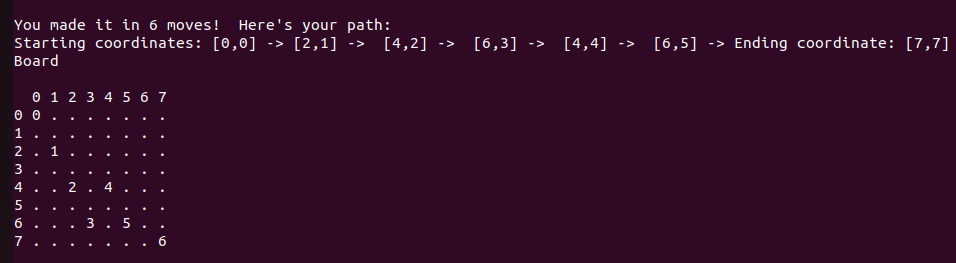

# Knight Travails

## Description
Apply DSA skills by building an Adjacency List and using BFS, Breadth First Search in order to get the shortest possible way to get from one square to another for a knight in chess.

## Example

By putting the following code in knightTravails.js:

```js client
knightMvt.getPath([0,0],[7,7])
```

And executing the js file using node:

```console
foo@bar:~$ node knightTravails.js
```

We get:



